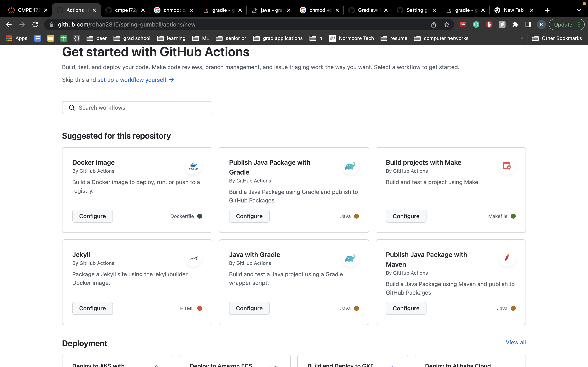
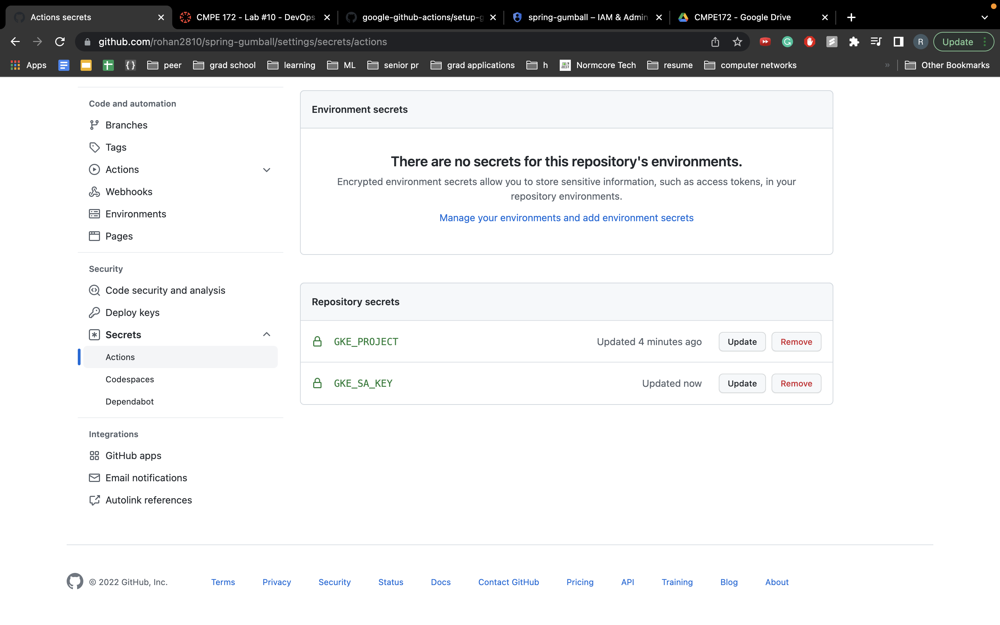
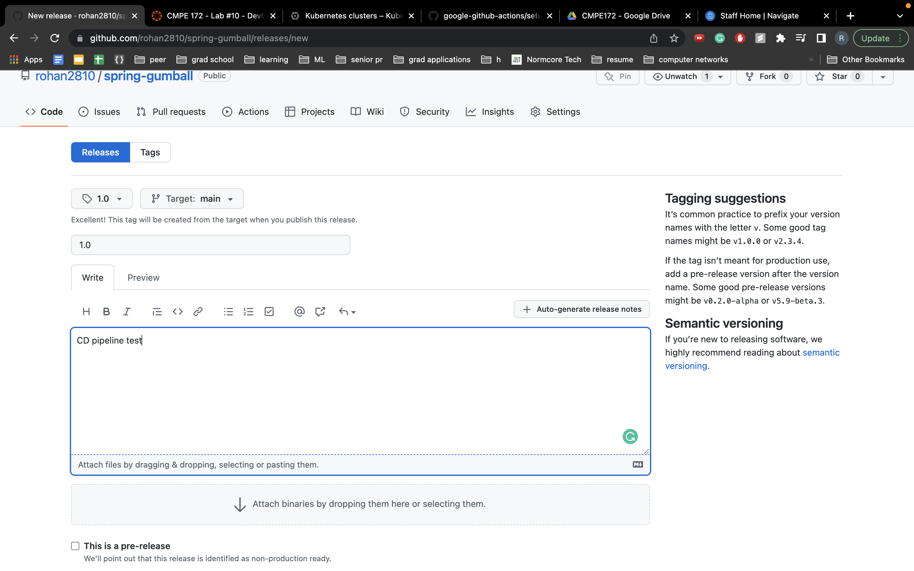
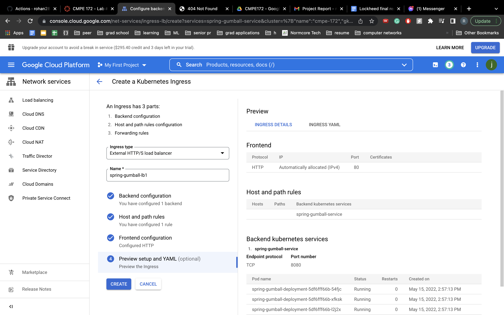

# spring-gumball ci/cd example

# screenshots
## 
## 
## 
## 
## 
## 
## 
## 
## 
## 
## 
## 
## 
## 
## 
## 
## 
## 
## 
## 

# Issue faced
The only issue I faced while working on this was instead of adding the .github/workflows/gradle.yml under the spring-gumball directory, I was adding it under the lab-10 directory. I fixed it by moving the gradle.yml file to the spring-gumball directory.
### This example demonstrates the following two GitHub Workflows.

* https://help.github.com/actions/language-and-framework-guides/building-and-testing-java-with-gradle

* https://github.com/google-github-actions/setup-gcloud/tree/master/example-workflows/gke

### Build Dependencies

* Gradle 5.6
* JDK 11
